# Vehicle Rental System - Practical Assignment (Laravel 3 Tables & Nested Relasi)

Panduan tugas praktikum pengembangan aplikasi web berbasis **Laravel** dengan fokus pada **3 Tabel Berelasi** (*Chain Relation* / Relasi Bertingkat). Modul ini melatih logika bisnis sederhana di Controller dan penyajian data dengan *Nested Eager Loading*.

---

## 📌 1. Deskripsi Proyek
**Sistem Rental Kendaraan (Vehicle Rental System)** adalah aplikasi untuk mendata merek, armada kendaraan, dan transaksi penyewaan. 
Tugas ini meningkatkan kompleksitas dari modul sebelumnya dengan memperkenalkan:
1. **Relasi Bertingkat (3 Tabel):** Merek (Brand) -> Kendaraan (Vehicle) -> Transaksi Sewa (Rental).
2. **Nested Eager Loading:** Mengambil data relasi dari relasi lainnya (`with('vehicle.brand')`).
3. **Logika Bisnis di Controller:** Menghitung total harga sewa secara otomatis berdasarkan harga per hari dikali durasi sewa sebelum disimpan ke database.

---

## 🗄️ 2. Spesifikasi ERD & Database Schema

Relasi yang digunakan adalah rentetan **One-to-Many**:
* 1 `Brand` memiliki banyak `Vehicle`.
* 1 `Vehicle` dimiliki oleh 1 `Brand`.
* 1 `Vehicle` dapat disewa berkali-kali (banyak `Rental`).
* 1 `Rental` mencatat penyewaan 1 `Vehicle`.

```text
 [brands] 1 ------ N [vehicles] 1 ------ N [rentals]
 +----+              +----+                +----+
 | id |              | id |                | id |
 |name|              |brand_id (FK)        |vehicle_id (FK)
 +----+              |name|                |customer_name|
                     |price_per_day|       |start_date|
                     +----+                |duration_days|
                                           |total_price|
                                           +----+
```

### Tabel 1: `brands` (Merek Kendaraan)
| Kolom | Tipe Data | Keterangan |
| :--- | :--- | :--- |
| `id` | BigInteger (PK) | Auto increment |
| `name` | String (100) | Nama merek (Honda, Toyota, dll) |
| `timestamps` | Timestamps | Created/Updated at |

### Tabel 2: `vehicles` (Armada Kendaraan)
| Kolom | Tipe Data | Keterangan |
| :--- | :--- | :--- |
| `id` | BigInteger (PK) | Auto increment |
| `brand_id` | BigInteger (FK) | Merujuk ke `brands.id` (`cascade`) |
| `name` | String (150) | Nama mobil (misal: "Avanza Veloz") |
| `plate_number` | String (15) | Nomor Polisi (Unik) |
| `price_per_day`| Decimal (12,2) | Harga sewa per hari |
| `timestamps` | Timestamps | Created/Updated at |

### Tabel 3: `rentals` (Transaksi Sewa)
| Kolom | Tipe Data | Keterangan |
| :--- | :--- | :--- |
| `id` | BigInteger (PK) | Auto increment |
| `vehicle_id` | BigInteger (FK) | Merujuk ke `vehicles.id` (`cascade`) |
| `customer_name`| String (150) | Nama penyewa |
| `start_date` | Date | Tanggal mulai sewa |
| `duration_days`| Integer | Lama sewa (dalam hari) |
| `total_price` | Decimal (15,2) | Total harga (Otomatis: durasi * harga/hari) |
| `timestamps` | Timestamps | Created/Updated at |

---

## 🚀 3. Panduan Langkah Pengerjaan

### Tahap 1: Inisialisasi & Konfigurasi
1. Buat proyek Laravel baru: `composer create-project laravel/laravel vehicle-rental`
2. Buat database baru (misal: `db_vehicle_rental`) dan sesuaikan file `.env`.

---

### Tahap 2: Pembuatan Skema Migration
Buat 3 migration secara berurutan:
```bash
php artisan make:migration create_brands_table
php artisan make:migration create_vehicles_table
php artisan make:migration create_rentals_table
```

* **Migration `brands`:**
```php
Schema::create('brands', function (Blueprint $table) {
    $table->id();
    $table->string('name', 100);
    $table->timestamps();
});
```

* **Migration `vehicles`:**
```php
Schema::create('vehicles', function (Blueprint $table) {
    $table->id();
    $table->foreignId('brand_id')->constrained('brands')->onDelete('cascade');
    $table->string('name', 150);
    $table->string('plate_number', 15)->unique();
    $table->decimal('price_per_day', 12, 2);
    $table->timestamps();
});
```

* **Migration `rentals`:**
```php
Schema::create('rentals', function (Blueprint $table) {
    $table->id();
    $table->foreignId('vehicle_id')->constrained('vehicles')->onDelete('cascade');
    $table->string('customer_name', 150);
    $table->date('start_date');
    $table->integer('duration_days');
    $table->decimal('total_price', 15, 2);
    $table->timestamps();
});
```

Jalankan `php artisan migrate`.

---

### Tahap 3: Pembuatan Model & Relasi
Buat 3 model:
```bash
php artisan make:model Brand
php artisan make:model Vehicle
php artisan make:model Rental
```

* **`Brand.php`**:
```php
protected $fillable = ['name'];
public function vehicles() {
    return $this->hasMany(Vehicle::class);
}
```

* **`Vehicle.php`**:
```php
protected $fillable = ['brand_id', 'name', 'plate_number', 'price_per_day'];
public function brand() {
    return $this->belongsTo(Brand::class);
}
public function rentals() {
    return $this->hasMany(Rental::class);
}
```

* **`Rental.php`**:
```php
protected $fillable = ['vehicle_id', 'customer_name', 'start_date', 'duration_days', 'total_price'];
public function vehicle() {
    return $this->belongsTo(Vehicle::class);
}
```

---

### Tahap 4: Database Seeder (Data Dummy)
Buat seeder untuk menyiapkan data Master (`Brand` dan `Vehicle`).
```bash
php artisan make:seeder VehicleDataSeeder
```

Isi `VehicleDataSeeder.php`:
```php
use App\Models\Brand;
use App\Models\Vehicle;

public function run(): void
{
    $toyota = Brand::create(['name' => 'Toyota']);
    $honda = Brand::create(['name' => 'Honda']);

    Vehicle::create([
        'brand_id' => $toyota->id,
        'name' => 'Avanza Veloz',
        'plate_number' => 'B 1234 ABC',
        'price_per_day' => 400000
    ]);

    Vehicle::create([
        'brand_id' => $toyota->id,
        'name' => 'Innova Reborn',
        'plate_number' => 'B 5678 DEF',
        'price_per_day' => 600000
    ]);

    Vehicle::create([
        'brand_id' => $honda->id,
        'name' => 'Honda Brio',
        'plate_number' => 'D 9101 GHI',
        'price_per_day' => 300000
    ]);
}
```
Panggil di `DatabaseSeeder.php` dan jalankan `php artisan db:seed`.

---

### Tahap 5: Controller & Perhitungan Total Harga
Buat controller:
```bash
php artisan make:controller RentalController
```

Isi `RentalController.php`:
```php
namespace App\Http\Controllers;

use App\Models\Rental;
use App\Models\Vehicle;
use Illuminate\Http\Request;

class RentalController extends Controller
{
    public function index()
    {
        // Nested Eager Loading: Load relasi vehicle beserta brand dari vehicle tsb
        $rentals = Rental::with('vehicle.brand')->latest()->get();
        return view('rentals.index', compact('rentals'));
    }

    public function create()
    {
        // Load semua kendaraan beserta nama mereknya untuk dropdown
        $vehicles = Vehicle::with('brand')->orderBy('name', 'asc')->get();
        return view('rentals.create', compact('vehicles'));
    }

    public function store(Request $request)
    {
        $request->validate([
            'vehicle_id'    => 'required|exists:vehicles,id',
            'customer_name' => 'required|string|max:150',
            'start_date'    => 'required|date',
            'duration_days' => 'required|integer|min:1',
        ]);

        // LOGIKA BISNIS: Ambil harga per hari dari kendaraan yang dipilih
        $vehicle = Vehicle::findOrFail($request->vehicle_id);
        
        // Kalkulasi total harga
        $totalPrice = $vehicle->price_per_day * $request->duration_days;

        // Simpan data
        Rental::create([
            'vehicle_id'    => $request->vehicle_id,
            'customer_name' => $request->customer_name,
            'start_date'    => $request->start_date,
            'duration_days' => $request->duration_days,
            'total_price'   => $totalPrice, // Masukkan hasil kalkulasi
        ]);

        return redirect()->route('rentals.index')->with('success', 'Transaksi sewa berhasil dicatat!');
    }
}
```

Daftarkan rute di `routes/web.php`:
```php
use App\Http\Controllers\RentalController;
Route::get('/', function () { return redirect()->route('rentals.index'); });
Route::get('/rentals', [RentalController::class, 'index'])->name('rentals.index');
Route::get('/rentals/create', [RentalController::class, 'create'])->name('rentals.create');
Route::post('/rentals', [RentalController::class, 'store'])->name('rentals.store');
```

---

### Tahap 6: View Blade (Tailwind CSS)

**1. `resources/views/rentals/index.blade.php`**
```html
<!DOCTYPE html>
<html lang="id">
<head>
    <title>Daftar Transaksi Sewa</title>
    <script src="https://cdn.tailwindcss.com"></script>
</head>
<body class="bg-gray-100 p-8">
    <div class="max-w-6xl mx-auto space-y-6">
        @if (session('success'))
            <div class="p-4 bg-green-100 text-green-800 rounded">{{ session('success') }}</div>
        @endif

        <div class="flex justify-between items-center">
            <h1 class="text-3xl font-bold">Data Penyewaan Kendaraan</h1>
            <a href="{{ route('rentals.create') }}" class="bg-blue-600 text-white px-4 py-2 rounded shadow">Buat Transaksi</a>
        </div>

        <div class="bg-white rounded-lg shadow overflow-hidden">
            <table class="w-full text-left text-sm">
                <thead class="bg-gray-800 text-white">
                    <tr>
                        <th class="p-4">Penyewa</th>
                        <th class="p-4">Mobil (Merek)</th>
                        <th class="p-4">Tgl Sewa</th>
                        <th class="p-4">Durasi</th>
                        <th class="p-4">Total Biaya</th>
                    </tr>
                </thead>
                <tbody class="divide-y">
                    @forelse ($rentals as $rental)
                        <tr>
                            <td class="p-4 font-semibold">{{ $rental->customer_name }}</td>
                            <td class="p-4">
                                {{ $rental->vehicle->name }} 
                                <span class="text-xs bg-gray-200 px-2 py-1 rounded text-gray-700 ml-2">
                                    <!-- Menampilkan data dari nested relasi -->
                                    {{ $rental->vehicle->brand->name }}
                                </span>
                            </td>
                            <td class="p-4">{{ $rental->start_date }}</td>
                            <td class="p-4">{{ $rental->duration_days }} Hari</td>
                            <td class="p-4 font-bold text-blue-600">Rp {{ number_format($rental->total_price, 0, ',', '.') }}</td>
                        </tr>
                    @empty
                        <tr><td colspan="5" class="p-4 text-center">Belum ada transaksi</td></tr>
                    @endforelse
                </tbody>
            </table>
        </div>
    </div>
</body>
</html>
```

**2. `resources/views/rentals/create.blade.php`**
```html
<!DOCTYPE html>
<html lang="id">
<head>
    <title>Buat Transaksi</title>
    <script src="https://cdn.tailwindcss.com"></script>
</head>
<body class="bg-gray-100 p-8">
    <div class="max-w-xl mx-auto bg-white p-8 rounded-lg shadow">
        <h1 class="text-2xl font-bold mb-6">Formulir Penyewaan</h1>
        
        <form action="{{ route('rentals.store') }}" method="POST" class="space-y-4">
            @csrf
            <div>
                <label class="block font-semibold mb-1">Pilih Kendaraan *</label>
                <select name="vehicle_id" class="w-full border p-2 rounded" required>
                    <option value="">-- Pilih Armada --</option>
                    @foreach ($vehicles as $v)
                        <option value="{{ $v->id }}">
                            {{ $v->brand->name }} {{ $v->name }} (Rp {{ number_format($v->price_per_day, 0, ',', '.') }}/hari)
                        </option>
                    @endforeach
                </select>
            </div>
            
            <div>
                <label class="block font-semibold mb-1">Nama Penyewa *</label>
                <input type="text" name="customer_name" class="w-full border p-2 rounded" required>
            </div>

            <div class="grid grid-cols-2 gap-4">
                <div>
                    <label class="block font-semibold mb-1">Tanggal Mulai *</label>
                    <input type="date" name="start_date" class="w-full border p-2 rounded" required>
                </div>
                <div>
                    <label class="block font-semibold mb-1">Lama Sewa (Hari) *</label>
                    <input type="number" name="duration_days" min="1" class="w-full border p-2 rounded" required>
                </div>
            </div>

            <div class="pt-4 flex justify-end gap-2">
                <a href="{{ route('rentals.index') }}" class="bg-gray-300 px-4 py-2 rounded">Batal</a>
                <button type="submit" class="bg-blue-600 text-white px-4 py-2 rounded">Proses & Simpan</button>
            </div>
        </form>
    </div>
</body>
</html>
```

---

## 📋 4. Rubrik Penilaian Khusus

| Kriteria | Indikator Evaluasi | Bobot |
| :--- | :--- | :---: |
| **Relasi Bertingkat** | Membuat 3 migration dengan foreign key berantai (`brands` $\rightarrow$ `vehicles` $\rightarrow$ `rentals`). | 25% |
| **Business Logic** | Controller berhasil menghitung `total_price` dari `price_per_day * duration` secara akurat sebelum simpan. | 30% |
| **Nested Eager Loading**| View berhasil menampilkan nama Brand kendaraan dari relasi `$rental->vehicle->brand->name` tanpa error. | 25% |
| **Form Input Dinamis**| Dropdown di halaman *Create* berhasil merender daftar mobil berserta harga sewanya. | 20% |

---



```mermaid
flowchart TD
    %% Tahap 1
    subgraph T1[Tahap 1: Inisialisasi & Konfigurasi]
        direction TB
        A1[Jalankan composer create-project laravel/laravel vehicle-rental]
        A2[Buat database db_vehicle_rental]
        A3[Konfigurasi file .env]
        A1 --> A2 --> A3
    end

    %% Tahap 2
    subgraph T2[Tahap 2: Pembuatan Skema Migration]
        direction TB
        B1[Buat migration brands]
        B2[Buat migration vehicles]
        B3[Buat migration rentals]
        B4[Jalankan php artisan migrate]
        B1 --> B2 --> B3 --> B4
    end

    %% Tahap 3
    subgraph T3[Tahap 3: Pembuatan Model & Relasi]
        direction TB
        C1[Buat Model Brand: relasi hasMany vehicles]
        C2[Buat Model Vehicle: relasi belongsTo brand, hasMany rentals]
        C3[Buat Model Rental: relasi belongsTo vehicle]
        C1 --> C2 --> C3
    end

    %% Tahap 4
    subgraph T4[Tahap 4: Database Seeder]
        direction TB
        D1[Buat VehicleDataSeeder]
        D2[Isi dummy data Brand & Vehicle]
        D3[Daftarkan ke DatabaseSeeder.php]
        D4[Jalankan php artisan db:seed]
        D1 --> D2 --> D3 --> D4
    end

    %% Tahap 5
    subgraph T5[Tahap 5: Controller & Logika Bisnis]
        direction TB
        E1[Buat RentalController]
        E2[Buat method index: load rental dengan vehicle.brand]
        E3[Buat method create: load dropdown armada]
        E4[Buat method store: hitung total_price otomatis]
        E5[Daftarkan route di web.php]
        E1 --> E2 --> E3 --> E4 --> E5
    end

    %% Tahap 6
    subgraph T6[Tahap 6: View Blade]
        direction TB
        F1[Buat views/rentals/index.blade.php]
        F2[Buat views/rentals/create.blade.php]
        F1 --> F2
    end

    T1 --> T2
    T2 --> T3
    T3 --> T4
    T4 --> T5
    T5 --> T6
```

## Penjelasan Detail Tiap Tahapan

### Tahap 1: Inisialisasi & Konfigurasi
Fokus tahap ini adalah menyiapkan kerangka proyek.
1. Menjalankan perintah `composer create-project laravel/laravel vehicle-rental` untuk membuat base instalasi Laravel.
2. Membuat database baru melalui DBMS (seperti MySQL/MariaDB) dengan nama, misalnya `db_vehicle_rental`.
3. Mengubah file `.env` untuk menghubungkan proyek Laravel dengan database yang baru saja dibuat.

### Tahap 2: Pembuatan Skema Migration
Tahap ini digunakan untuk membuat struktur tabel di dalam database secara berurutan agar tidak terjadi masalah _foreign key constraint_.
1. **Migration `brands`**: Dibuat pertama kali karena tidak memiliki _foreign key_. Tabel ini menyimpan data Merek.
2. **Migration `vehicles`**: Dibuat kedua karena bergantung pada tabel `brands` (berelasi ke `brand_id`). Tabel ini mencatat armada kendaraan.
3. **Migration `rentals`**: Dibuat terakhir karena menyimpan catatan penyewaan dan bergantung pada tabel `vehicles` (`vehicle_id`).
4. Setelah tiga skema siap, eksekusi menggunakan `php artisan migrate`.

### Tahap 3: Pembuatan Model & Relasi
Langkah ini menyiapkan Model yang akan menghubungkan tabel database dengan sistem Laravel (ORM Eloquent), beserta mendefinisikan hubungan (relasi) antar tabel.
1. **Model Brand**: Memiliki relasi `hasMany` ke kendaraan (1 Merek punya banyak Kendaraan).
2. **Model Vehicle**: Memiliki relasi kebalikan `belongsTo` ke Brand, serta relasi `hasMany` ke Rentals (1 Kendaraan dapat disewa berkali-kali).
3. **Model Rental**: Memiliki relasi `belongsTo` ke Vehicle.

### Tahap 4: Database Seeder (Data Dummy)
Mengisi data awal ke database agar aplikasi bisa langsung diujicoba tanpa harus repot input manual.
1. Pembuatan seeder terpisah `VehicleDataSeeder`.
2. Pengisian data utama Merek (seperti Toyota, Honda) dilanjutkan dengan data Kendaraan yang terhubung ke merek tersebut beserta besaran harga sewanya (`price_per_day`).
3. Mendaftarkannya di kelas utama `DatabaseSeeder.php` dan mengeksekusinya via terminal `php artisan db:seed`.

### Tahap 5: Controller & Logika Bisnis
Pusat kontrol dan logika pemrosesan perhitungan total biaya.
1. Pembuatan `RentalController`.
2. Method `index()`: Mengambil semua data penyewaan sekaligus menarik relasi bertingkat (Nested Eager Loading) menggunakan `Rental::with('vehicle.brand')`.
3. Method `create()`: Mengambil daftar armada dan relasi merek untuk dimunculkan pada _dropdown form_.
4. Method `store()`: Merupakan tempat logika bisnis dieksekusi. Controller mengambil ID kendaraan yang dipilih, melihat harga sewanya (`price_per_day`), dan mengalikannya dengan lama sewa (`duration_days`) untuk mendapatkan `total_price` otomatis sebelum disimpan ke database.
5. Pembuatan Route Web di file `web.php` untuk mengarahkan URL ke method di dalam controller.

### Tahap 6: View Blade (Tailwind CSS)
Menyiapkan bagian antarmuka (User Interface) menggunakan komponen Tailwind CSS.
1. `index.blade.php`: Menampilkan tabel penyewaan. Data relasi bertingkat ditampilkan langsung di tabel (menampilkan nama kendaraan beserta nama merek dari tabel terpisah).
2. `create.blade.php`: Menampilkan form penyewaan dan melakukan kalkulasi dropdown yang dinamis, menunjukkan nama armada dan harga sewanya.

